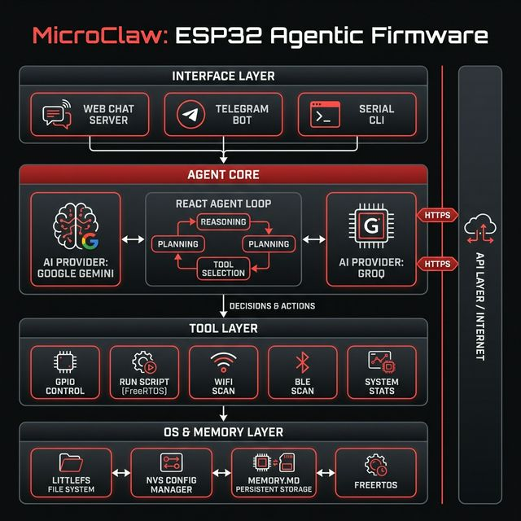

<div align="center">

#  MicroClaw

### Agentic Firmware for ESP32

[](LICENSE)
[](https://platformio.org/)
[](https://python.org)
[](https://abhimanyus1997.github.io/microclaw/)

MicroClaw is an **agentic firmware** that transforms a **$2 ESP32** into a general-purpose physical AI — capable of **reasoning**, **remembering**, and **acting** in the real world. Powered by **Google Gemini** or **Groq**, it turns any ESP32 into an intelligent node that can control hardware, scan networks, and hold conversations — all through natural language.

[Features](#-features) • [Quick Start](#-quick-start) • [Web UI](#-microclaw-manager) • [Hardware](#-hardware)

</div>

---

## ✨ Features

| | Feature | Description |
|---|---|---|
| 🧠 | **Dual AI Brain** | Switch between **Google Gemini** and **Groq** as the reasoning backend |
| 🦾 | **Autonomous Tool Use** | The AI decides when to call tools — GPIO control, WiFi/BLE scanning, scripting |
| 📜 | **Scriptable Hardware** | AI generates and runs GPIO scripts (blink patterns, sequences, loops) via FreeRTOS tasks |
| 💾 | **Persistent Memory** | Remembers context across reboots using LittleFS-backed `MEMORY.md` |
| 🌐 | **On-Device Web Chat** | ESP32 hosts its own web server — chat with the AI from any browser on your network |
| 💬 | **Multi-Interface** | Interact via **Web UI**, **Telegram**, or **Serial Terminal** |
| 📡 | **BLE + WiFi Scanning** | Discover nearby Bluetooth devices and WiFi networks through conversation |
| 🖥️ | **Desktop Manager** | Python web app for flashing, configuring, and monitoring — no code editing needed |

---

## 🏗️ Architecture

<div align="center">

</div>

---

## 🚀 Quick Start

### Prerequisites
- **ESP32 Dev Board** (e.g., ESP32 DevKit V1)
- **Python 3.10+** with [uv](https://github.com/astral-sh/uv) (recommended) or pip
- An API key for **Google Gemini** or **Groq**

### 1. Install Dependencies

```bash
# Using uv (recommended)
uv venv && uv pip install -r tools/requirements.txt

# Or using pip
pip install -r tools/requirements.txt
```

### 2. Launch the Manager

```bash
python3 main.py
# Opens at http://localhost:8000
```

The Manager handles USB permissions automatically (requests sudo once).

### 3. Flash & Configure
1. Open the **Setup Tab** → flash the firmware binary (or build from source).
2. Enter your **WiFi credentials** and **API key** (Gemini or Groq).
3. Switch to the **Monitor Tab** — watch the firmware boot and connect.

### 4. Chat
Once connected to WiFi, the ESP32 serves a web chat at its local IP. Open it in any browser and start talking:

> *"Blink the LED on pin 2 five times"* → AI writes a script → LED blinks  
> *"Scan for nearby WiFi networks"* → AI calls `wifi_scan` → returns results  
> *"Remember that the red wire is VCC"* → AI writes to persistent memory  

---

## 🖥️ MicroClaw Manager

The desktop manager is a Python-based web UI for setup and monitoring:

- **Real-time Serial Monitor** — color-coded live logs
- **One-click Flash** — upload firmware binaries directly
- **Device Configuration** — WiFi, API keys, Telegram token
- **Smart Controls** — restart device, scan networks, send commands

<div align="center">

| Terminal Monitor | Configuration | Build & Flash |
|:---:|:---:|:---:|
|  |  |  |
| *Live serial output* | *WiFi, API keys & firmware setup* | *One-click build & OTA flash* |

</div>

---

## 💬 On-Device Web Chat

The ESP32 hosts its own web server for direct AI chat over your local network:

<div align="center">

<p><em>Chat interface served directly from the ESP32 — system stats, GPIO control, and AI reasoning in real time.</em></p>
</div>

---

## 🛠️ Tool System

The firmware exposes a set of tools that the AI can invoke autonomously:

| Tool | Description |
|---|---|
| `run_script` | Execute GPIO sequences (blink, patterns, loops) as background FreeRTOS tasks |
| `gpio_control` | Read or write individual GPIO pins |
| `wifi_scan` | Scan nearby WiFi networks and return results |
| `ble_scan` | Scan for nearby Bluetooth Low Energy devices |
| `ble_connect` / `ble_disconnect` | Connect to or disconnect from a BLE device |
| `memory_write` / `memory_read` | Persist and recall information across reboots |
| `get_system_stats` | Return heap, flash, CPU, and uptime info |

The AI uses a **ReAct-style agent loop** — it reasons about the user's request, selects a tool, observes the result, and then formulates a response.

---

## 📁 Project Structure

```
microclaw/
├── firmware/                    # Agentic Firmware (C++ / PlatformIO)
│   ├── src/main.cpp             # Agent loop, setup, interfaces
│   ├── include/
│   │   ├── gemini_client.h      # Google Gemini API client
│   │   ├── groq_client.h        # Groq API client
│   │   ├── tools.h              # Tool dispatcher + script engine
│   │   ├── gpio_tools.h         # GPIO read/write
│   │   ├── wifi_tools.h         # WiFi scanning
│   │   ├── ble_tools.h          # BLE scanning & connection
│   │   ├── system_tools.h       # System stats (heap, flash, CPU)
│   │   ├── web_server.h         # On-device web chat server
│   │   ├── telegram_bot.h       # Telegram bot interface
│   │   ├── cli.h                # Serial CLI commands
│   │   ├── config_manager.h     # NVS-backed configuration
│   │   ├── wifi_manager.h       # WiFi connection manager
│   │   └── file_system.h        # LittleFS wrapper
│   └── platformio.ini           # Build configuration
├── tools/                       # Desktop Manager (Python)
│   ├── web_ui.py                # FastAPI web UI (flash, config, monitor)
│   ├── microclaw.py             # CLI tool (setup wizard, flash, monitor)
│   └── requirements.txt         # Python dependencies
├── docs/                        # Documentation & screenshots
├── main.py                      # Launcher (auto-handles sudo for serial access)
├── config.example.json          # Sample device configuration
└── README.md
```

---

## 👨‍💻 Development

### Firmware (C++ / PlatformIO)

```bash
cd firmware
pio run              # Build
pio run -t upload    # Build & flash
pio device monitor   # Serial monitor
```

### CLI Tool (Python)

```bash
python tools/microclaw.py --help       # All commands
python tools/microclaw.py setup        # Interactive setup wizard
python tools/microclaw.py monitor      # Serial monitor
```

### Configuration

Copy and edit the example config, then burn it to the device:
```bash
cp config.example.json config.json
# Edit config.json with your WiFi + API credentials
python tools/microclaw.py setup --config config.json
```

Or configure interactively via Serial (baud 115200):
```
wifi_set MySSID MyPassword
set_api_key AIzaSy...
restart
```

---

## 🔧 Hardware

| Component | Details |
|---|---|
| **ESP32 Dev Board** | ESP32 DevKit V1 or equivalent |
| **Power** | USB or external battery |
| **Peripherals** | Any GPIO-controllable hardware (LEDs, relays, servos, sensors) |

> The firmware is **peripheral-agnostic** — the AI controls whatever you wire up via the `run_script` and `gpio_control` tools.

---

## 📄 License

MIT

---

<div align="center">
Created by <b>Abhimanyu Singh</b> • <a href="https://github.com/abhimanyus1997">GitHub</a> • <a href="https://linkedin.com/in/abhimanyus1997">LinkedIn</a>
</div>
